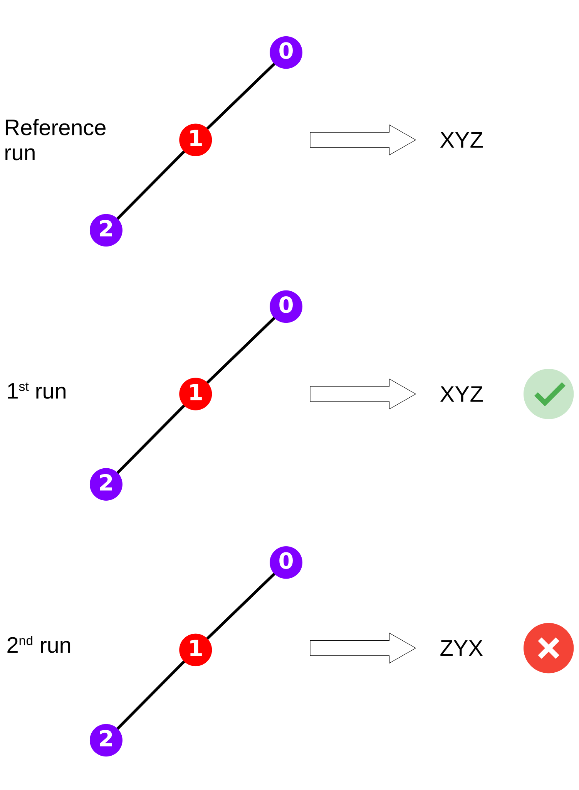
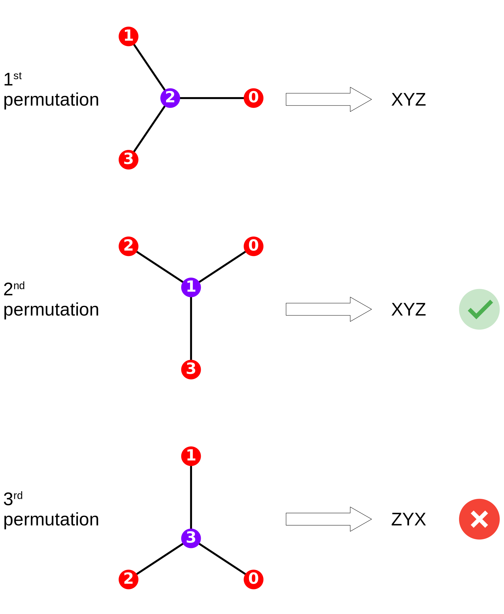

# Testing InChI v1.7.0

## Jan C. Brammer, RWTH Aachen

24.07.2024

---
# Test infrastructure

* InChI 1.7.0 compiled with GCC 14.1.0
* Debian bookworm
* 16 physical cores
* https://github.com/IUPAC-InChI/InChI/tree/main/INCHI-1-TEST

---
# PubChem Datasets

https://ftp.ncbi.nlm.nih.gov/pubchem/

| | Compound | Compound 3D | Substance |
|---|---|---|---|
| downloada | Oct 13 2023 | Oct 25 2023 | Oct 23 2023 |
| size in GB (gzip)b | 99 | 37 | 81 |
| N SDFc | 338 | 1,103 | 895 |
| N structuresd | 114,726,411 | 23,487,296 | 306,711,305 |

---
# Regression

Are InChIs stable across version 1.06 and version 1.07?

---
# Regression Results

| | Compound | Compound 3D | Substance |
|---|---|---|---|
| N structures passeda | 114,726,411 | 23,487,296 | 306,711,303 |
| N structures failedb | 0 | 0 | 2 |
| N structures error | 0 | 0 | 0 |
| percentage failedc | 0 | 0 | 0.00000064 |
| run-time totald | 402 min (6 hrs, 42 min) | 106 min (1 hr, 46 min) | 585 min (9 hrs, 45 min) |
| avg run-time per structuree | 0.21 ms | 0.27 ms | 0.114 ms |

---
# Invariance

Are InChIs canonical?

---
# Invariance Results

| | Compound | Compound 3D | Substance |
|---|---|---|---|
| N structures passeda | n/a | 23,487,290 | 289,776,775 |
| N structures failedb | n/a | 6 | 2,131 |
| N structures error | n/a | 0 | 16,932,378c,d + 21e,f = 16,932,399 |
| percentage failedg | n/a | 0.000026 | 0.000735 |
| run-time totalh | n/a | 389 min (6 hrs, 29 min) | 4,063 min (2 days, 18 hrs, 43 min) |
| avg run-time per structurei | n/a | 0.98 ms | 0.84 ms |

---
# Details PubChem Datasets

a) `find . -type f -name "*.gz" -exec du -b {} + | awk '{ total += $1 } END { print total / 1024 / 1024 / 1024 " GB" }'`
b) according to `.listing` file from PubChem FTP download
c) `ls *.sdf.gz | wc -l`
d) `totalCount=0; for file in ./*.sqlite; do count=$(sqlite3 "$file" "SELECT COUNT(*) FROM results;"); totalCount=$((totalCount + count)); done; echo $totalCount`

---
# Details Regression

a) N structures - (N structures error + N structures failed)
b) `grep -o "test failed" ./<log-name>.log | wc -l`
c) N structures failed / (N structures - N structures error) * 100
d) last timestamp - first timestamp from logs
e) run-time total / (N structures passed + N structures failed) * 60000

---
# Details Invariance

a) N structures - (N structures error + N structures failed)
b) `grep -o "test failed" ./<log-name>.log | wc -l`
c) `grep -o "test didn't run" ./<log-name>.log | wc -l`
d) empty molfiles; see e.g., https://pubchem.ncbi.nlm.nih.gov/rest/pug/substance/sid/2167/record/SDF

---
# Details Invariance (continued)

e) `grep -o "RuntimeError" ./<log-name>.log | wc -l`
f) InChI failed to process molfiles
g) N structures failed / (N structures - N structures error) * 100
h) last timestamp - first timestamp from logs
i) run-time total / (N structures passed + N structures failed) * 60000
